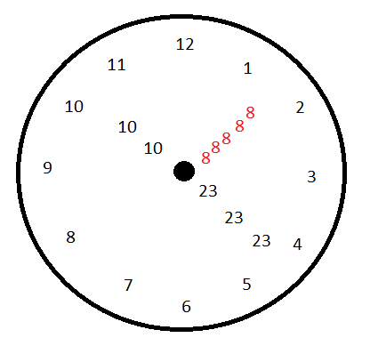

Vi isso na internet e achei que seria algo interessante de começar

A idéia é que o relógio seja igual um relógio analógico comum, exceto por uma coisa: Os ponteiros. Os ponteiros representam a hora, minutos e segundos atuais

A princípio, main será em python e depois penso em abrir talvez uma ou duas branches para C e talvez alguma outra lingua sei la

